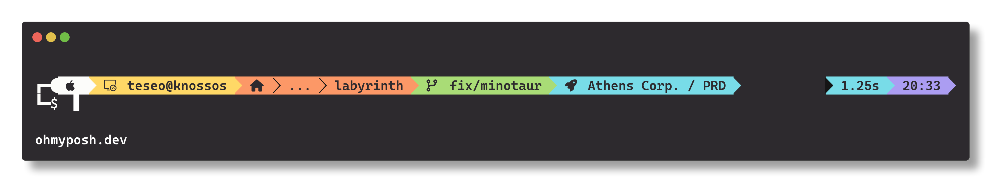

# Monokai Pro (CE) for [Oh My Posh](https://ohmyposh.dev)

## About this theme

This Monokai Pro Community Edition (CE) theme is maintained by [Josué Estrada](https://github.com/JosueEstrada) and is based on the original [Monokai Pro](https://monokai.pro) theme.

Recommended font: [CaskaydiaCove Nerd Font](https://github.com/ryanoasis/nerd-fonts/tree/master/patched-fonts/CascadiaCode)

[Installation instructions](INSTALL.md)

[MIT License](LICENSE.md)

## Monokai Pro for more apps

